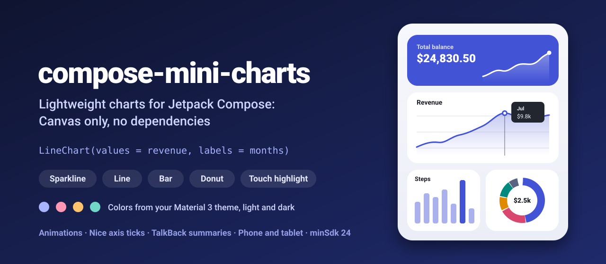
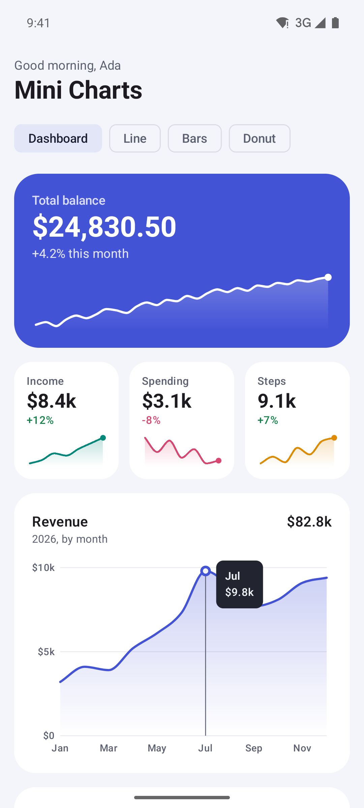
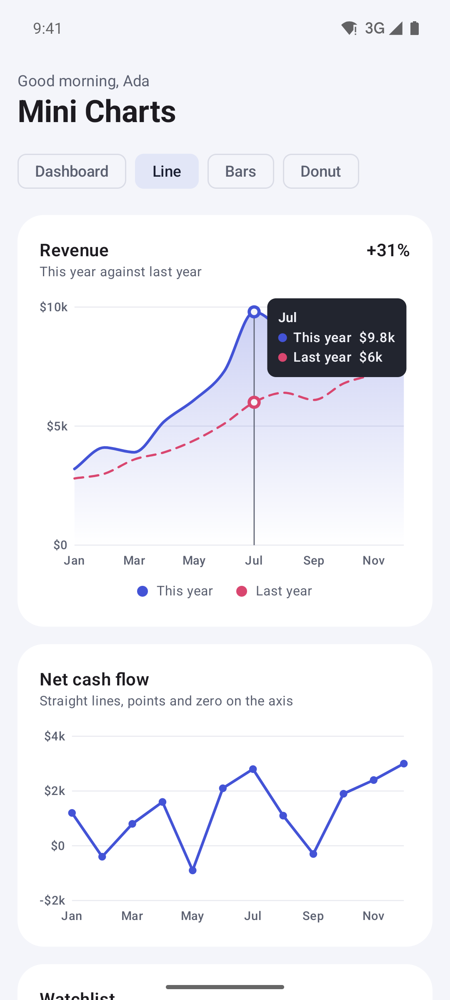
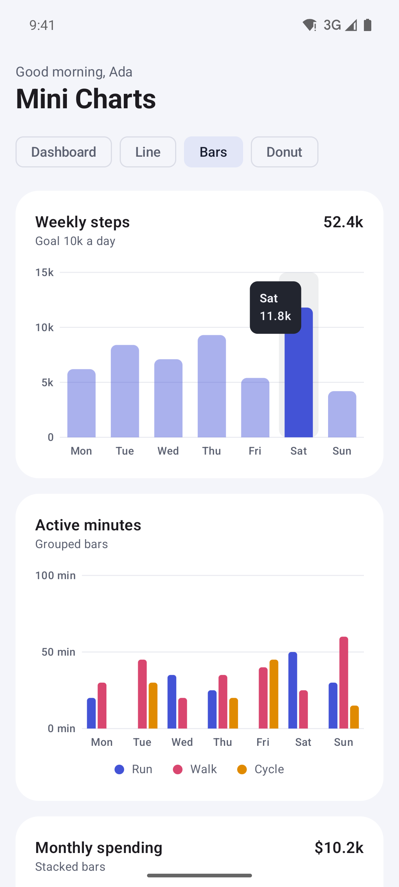
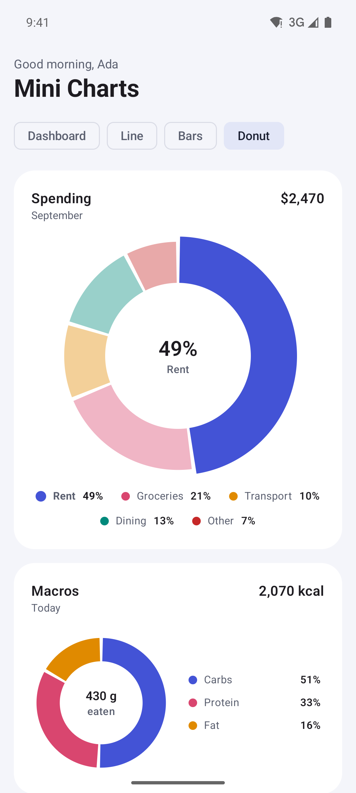
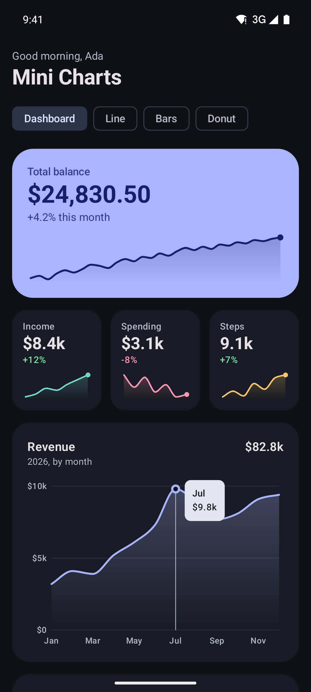
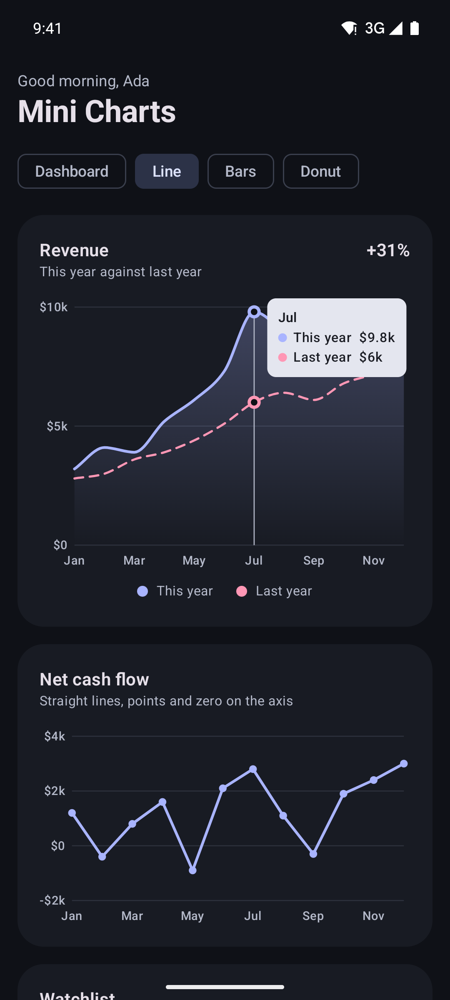
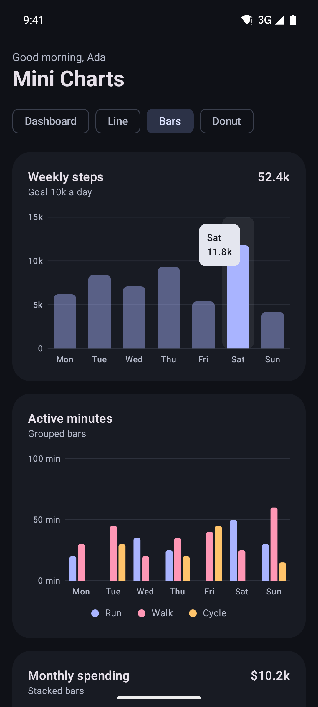
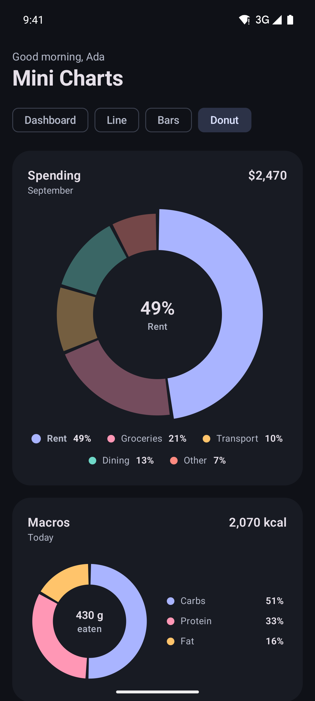
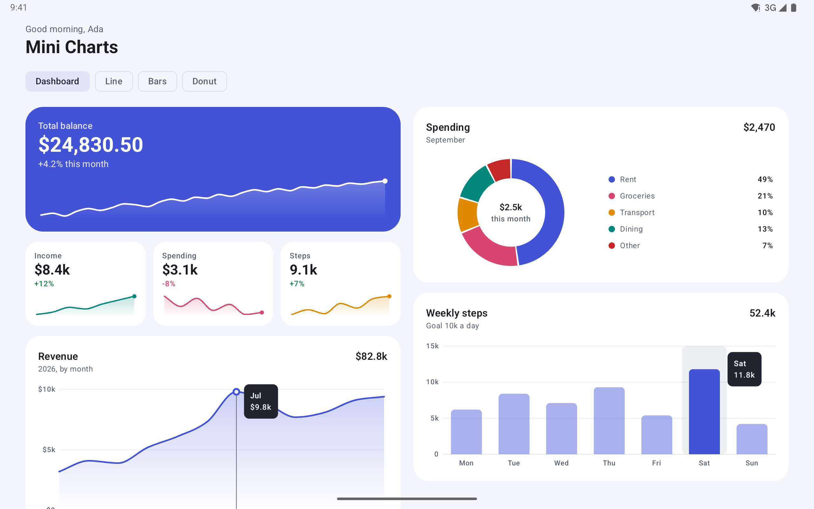

<p align="center">
  
</p>

<p align="center">
  <a href="https://github.com/halilozel1903/compose-mini-charts/actions/workflows/ci.yml"></a>
  <a href="https://jitpack.io/#halilozel1903/compose-mini-charts"></a>
  
  
  
  
  <a href="LICENSE"></a>
</p>

**compose-mini-charts** is lightweight charts for Jetpack Compose: a sparkline, a line chart, a bar chart and a donut, drawn on a `Canvas` with nothing but Compose. They animate in, follow your Material 3 theme in light and dark mode, show values in a tooltip when you tap or drag, and describe themselves to TalkBack ("Revenue, 12 points, from 3.2k to 9.8k, highest in Jul"). Axis ticks, smoothing, layout, hit testing and formatting live in a pure Kotlin module with unit tests.

```kotlin
LineChart(
    values = listOf(3_200, 4_100, 3_900, 5_200, 6_100, 7_300, 9_800, 8_900, 7_700, 8_100, 9_100, 9_400),
    labels = listOf("Jan", "Feb", "Mar", "Apr", "May", "Jun", "Jul", "Aug", "Sep", "Oct", "Nov", "Dec"),
    title = "Revenue",
    modifier = Modifier.fillMaxWidth().height(220.dp),
)
```

## Screenshots

Captured from the sample app on an Android emulator by CI.

| Dashboard | Line charts | Bar charts | Donuts |
| :---: | :---: | :---: | :---: |
|  |  |  |  |
|  |  |  |  |

**Tablet:** the same dashboard in two columns.



## Features

- **Four charts**: `Sparkline`, `LineChart`, `BarChart` and `DonutChart`, plus a `ChartLegend` you can use on its own.
- **Canvas only, no dependencies**: just Compose UI, foundation and Material 3, which your app already has. Nothing else is pulled in.
- **Line charts**: one or more series, straight or smooth (monotone cubic: smooth, but never above or below the data between two points), gradient area fill, dashed lines, points, grid lines and axis labels.
- **Bar charts**: one or more series, grouped or stacked, negative values, rounded value ends, spacing you choose.
- **Donut charts**: gaps between slices, a label and value in the middle, a legend under or beside the ring with each slice's share (always adding up to 100%).
- **Touch highlight**: tap or drag across a line or bar chart to show a guide and a tooltip with every series' value; tap a slice or legend item of a donut to bring it forward. `initialHighlight` preselects one and `onHighlightChange` tells you about changes.
- **Entry animations**: lines draw from left to right, bars grow and donuts unfold. Pass `animationSpec = null`, or provide `LocalChartAnimationsEnabled provides false`, to show the final chart at once (screenshot tests).
- **Nice axes**: ticks on round numbers (1, 2 or 5 times a power of ten, after Heckbert), compact labels like 3.2k and 1.2M, x labels that skip themselves instead of overlapping.
- **Material 3 theming**: colors come from `MaterialTheme.colorScheme` and follow light, dark and dynamic color. Override any of them with `ChartDefaults.colors(...)`, or give a series its own color.
- **Accessibility**: every chart has a content description generated from its data ("Weekly steps, 7 bars, from 4.2k to 11.8k, tallest Sat"), and the highlighted value is its state description.
- **Any numbers**: pass `List<Int>`, `List<Float>`, `List<Double>` or a mix.
- **Phone and tablet**: charts fill the space they get; the sample switches to two columns at 720 dp.
- **Pure Kotlin core** (`compose-mini-charts-core`): nice ticks, scales, line paths, bar and donut layout, hit testing, formatting and summaries, unit tested and usable from any JVM module.

## Installation

Add JitPack to `settings.gradle.kts`:

```kotlin
dependencyResolutionManagement {
    repositories {
        google()
        mavenCentral()
        maven("https://jitpack.io")
    }
}
```

Then the dependency:

```kotlin
dependencies {
    implementation("com.github.halilozel1903.compose-mini-charts:compose-mini-charts:1.0.0")
    // Pure Kotlin chart math only (for JVM/KMP modules or your own drawing):
    // implementation("com.github.halilozel1903.compose-mini-charts:compose-mini-charts-core:1.0.0")
}
```

> The build is also set up for Maven Central (`io.github.halilozel1903:compose-mini-charts`) via the vanniktech publish plugin.

## Usage

Charts take the size you give them, so set a height (or a size for sparklines).

**Sparkline**

```kotlin
Sparkline(
    values = balance,                       // List<Number>
    color = MaterialTheme.colorScheme.primary,
    highlightMinMax = true,                 // dots on the lowest and highest point
    title = "Balance",                      // for TalkBack: "Balance, 30 points, from ..."
    modifier = Modifier.size(width = 96.dp, height = 28.dp),
)
```

**Line chart with several series**

```kotlin
LineChart(
    series = listOf(
        LineSeries("This year", revenue),
        LineSeries("Last year", revenueLastYear, fill = false, dashed = true),
    ),
    labels = months,
    title = "Revenue",
    valueFormatter = ValueFormatter.affixed(prefix = "$"),   // $3.2k
    initialHighlight = 6,                                    // show July's tooltip at first
    onHighlightChange = { index -> selectedMonth = index },
    modifier = Modifier.fillMaxWidth().height(280.dp),
)
```

`LineSeries` takes `color`, `fill`, `curve` (`LineCurve.Smooth` or `Straight`), `strokeWidth` and `dashed`. `LineChart` also has `showGrid`, `showYAxis`, `showXAxis`, `yTickCount`, `includeZero`, `showPoints`, `showLegend` and `highlightEnabled`.

**Bar chart, grouped or stacked**

```kotlin
BarChart(values = steps, labels = days, title = "Weekly steps", modifier = Modifier.fillMaxWidth().height(200.dp))

BarChart(
    series = listOf(
        BarSeries("Bills", bills),
        BarSeries("Food", food),
        BarSeries("Travel", travel),
    ),
    labels = months,
    title = "Monthly spending",
    mode = BarMode.Stacked,               // or BarMode.Grouped
    cornerRadius = 6.dp,
    groupSpacing = 0.35f,                 // part of each slot left empty
    modifier = Modifier.fillMaxWidth().height(260.dp),
)
```

**Donut chart**

```kotlin
DonutChart(
    slices = listOf(
        DonutSlice("Rent", 1_200),
        DonutSlice("Groceries", 520),
        DonutSlice("Transport", 260),
        DonutSlice("Other", 180, color = Color.Gray),
    ),
    title = "Spending",
    centerLabel = "this month",           // centerValue defaults to the total
    valueFormatter = ValueFormatter.affixed(prefix = "$"),
    legendPosition = LegendPosition.End,  // Bottom, End or None
    gapDegrees = 2f,
    modifier = Modifier.fillMaxWidth().height(180.dp),
)
```

A two slice donut with `legendPosition = LegendPosition.None` and `centerValue = "72%"` makes a progress ring.

**Theming**

```kotlin
val colors = ChartDefaults.colors(
    series = listOf(Brand.Indigo, Brand.Coral, Brand.Amber),
    tooltipContainer = MaterialTheme.colorScheme.primaryContainer,
    tooltipContent = MaterialTheme.colorScheme.onPrimaryContainer,
)
LineChart(series = series, colors = colors, modifier = Modifier.height(220.dp))
```

**Turning animations off**, for example in screenshot tests:

```kotlin
CompositionLocalProvider(LocalChartAnimationsEnabled provides false) {
    Dashboard()
}
```

## The core module

`compose-mini-charts-core` has no Android or Compose dependency. The charts are built on it, and you can use it for your own drawing or for tests:

```kotlin
NiceScale.ticks(3_200.0, 9_800.0).values             // [2000.0, 4000.0, 6000.0, 8000.0, 10000.0]
ChartFormat.compact(1_234_567.0)                      // "1.2M"
ChartFormat.percentages(listOf(1.0, 1.0, 1.0))        // [34.0, 33.0, 33.0], always 100 in total
ChartSummary.line("Revenue", revenue, months)         // "Revenue, 12 points, from 3.2k to 9.8k, highest in Jul"

val area = PlotArea(left = 0f, top = 0f, right = 300f, bottom = 100f)
val points = LineGeometry.points(values, area, yMin = 0.0, yMax = 10.0)
val path = LineGeometry.segments(points, LineCurve.Smooth)   // MoveTo, CubicTo, ...
HitTest.nearestIndex(points.map { it.x }, touchX)

BarGeometry.layout(data, area, yMin, yMax, BarMode.Stacked)  // a BarRect per value
DonutGeometry.arcs(values, startAngle = -90f, gapDegrees = 2f)
DonutGeometry.hitTest(arcs, dx, dy, innerRadius, outerRadius)
```

| API | What it does |
| --- | --- |
| `NiceScale` | Heckbert's nice numbers and axis ticks, optionally including zero, with floating point noise removed |
| `LinearScale`, `PlotArea`, `ValueRange`, `ChartData` | Mapping values to pixels and back, ranges, normalization to 0..1 |
| `LineGeometry` | Point positions, straight and monotone cubic path segments |
| `BarGeometry` | Grouped and stacked bar rectangles with group, bar and stack spacing, negative values |
| `DonutGeometry` | Arc angles with gaps, angle of a touch, slice hit testing |
| `HitTest` | Nearest x index, nearest point, bar and group under a finger |
| `ChartFormat`, `ValueFormatter` | Locale independent numbers, compact units, percentages that add up to 100 |
| `ChartSummary` | One sentence descriptions of line, bar and donut charts for screen readers |

## Sample app

The `sample` module is a finance and fitness dashboard with four screens: Dashboard (balance sparkline, KPI tiles, revenue, spending and steps), Line, Bars and Donut. On screens 720 dp and wider it uses two columns.

Taps can't be timed reliably through adb, so the sample opens a screen from an intent extra, with animations off and highlights preselected (used by `scripts/screenshots.sh`):

```bash
./gradlew :sample:installDebug
adb shell am start -n io.github.halilozel1903.minicharts.sample/.MainActivity --es scene line
```

`scene` is one of `dashboard`, `line`, `bars` or `donut`. CI captures each in light and dark mode on a phone, and the dashboard on a tablet, checks every capture for the screen's text and fails on blank images.

## Project structure

| Module | What it is |
| --- | --- |
| `charts-core` | Pure Kotlin: `NiceScale`, `LinearScale`, `LineGeometry`, `BarGeometry`, `DonutGeometry`, `HitTest`, `ChartFormat`, `ChartSummary`. Published as `compose-mini-charts-core` |
| `charts` | Compose: `Sparkline`, `LineChart`, `BarChart`, `DonutChart`, `ChartLegend`, `ChartDefaults`, `ChartColors`. Published as `compose-mini-charts` |
| `sample` | A finance and fitness dashboard for phone and tablet, with screenshot scenes |

## Tech stack

Kotlin 2.4 · AGP 9.4 with built-in Kotlin · Gradle 9.6 · Jetpack Compose (BOM 2026.09) · Material 3 · Compose Canvas and `TextMeasurer` · `Animatable` · Pointer input (tap and drag) · Semantics · GitHub Actions

## License

MIT. See [LICENSE](LICENSE).
